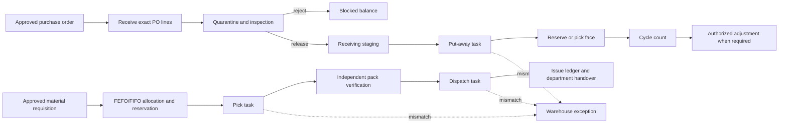
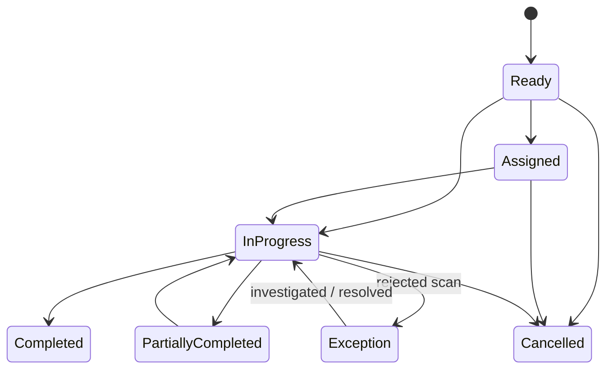

# HIMS Smart Warehousing — Architecture and Operations

## Purpose and boundary

This module extends the existing inventory ledger; it does not replace it. `item_stock_levels` remains the authoritative location/batch balance and `stock_movements` remains the financial and operational movement history. Warehouse tasks coordinate physical work and scans, then call `InventoryAutomationService` for every quantity change.

The attached research/specification PDF was treated as a requirements input, not as executable instructions or a legal authority. Numeric limits, retention periods, cryptographic controls, dual-custody rules, and environmental tolerances in that document are not encoded unless they are supported by existing HIMS policy or configurable master data.

## Evidence and policy register

| Area | Implemented interpretation | Authority / status |
|---|---|---|
| Storage and distribution | Manufacturer-labelled storage conditions, segregated quarantine/rejected stock, FEFO, monitoring, and reconciliation are supported by classifications, status buckets, lot expiry, task scans, and ledgers. | [WHO TRS 1025 Annex 7](https://www.who.int/publications/m/item/trs-1025-annex-7) |
| Philippine distribution practice | The system supports GDP-aligned records and warehouse controls but does not claim that software alone establishes compliance. | [FDA Advisory 2022-1895](https://www.fda.gov.ph/fda-advisory-no-2022-1895-reiteration-of-the-full-implementation-of-fda-administrative-order-no-2013-0027/) |
| GS1 | AI `(01)` resolves a GTIN, `(10)` a lot, `(17)` expiry, and `(21)` serial. HRI parentheses are display-only; scanner element strings and the GS separator are accepted. | [GS1 Application Identifiers](https://www.gs1.org/standards/barcodes/application-identifiers), [GS1 DataMatrix guideline](https://www.gs1.org/docs/barcodes/GS1_DataMatrix_Guideline.pdf) |
| Controlled substances | The design preserves item/lot/serial, actor, movement, and exception history. Institution-specific register fields and custody policy still require compliance-owner approval before controlled-drug deployment. | [DDB Board Regulation No. 1, s. 2014](https://ddb.gov.ph/images/Board_Resolution/2014/Board_Regulation_No_1_Series_of_2014.pdf) |
| Public procurement | Procurement integration remains on existing approval/PO services. RA 9184 is not treated as current authority because it was repealed by RA 12009. | [RA 12009](https://lawphil.net/statutes/repacts/ra2024/ra_12009_2024.html), [GPPB Public Advisory 09-2026](https://www.gppb.gov.ph/public-advisory-09-2026/) |
| Privacy and security | Least privilege, authenticated routes, append-only event models, reason capture, and audit redaction conventions apply. Retention must be set through institutional policy and privacy risk assessment. | [Data Privacy Act, Section 20](https://privacy.gov.ph/data-privacy-act/) |

## Readiness assessment

### Reused foundation

- Laravel authentication, role/permission gates, Sanctum API access, MFA enforcement, and audit logging.
- Item, category, supplier, warehouse hierarchy, item-batch, per-location balance, stock movement, quarantine, blocked, and in-transit models.
- Purchase order receiving, QC release/rejection, material requisitions, FEFO allocation, transfers, cycle counts, adjustments, replenishment, alerts, and reports.
- Transactions and row locks in inventory workflow services.

### Gaps closed by this increment

- Unified warehouse work queue and task lifecycle.
- Directed put-away after QC release and directed pick/pack/dispatch after requisition approval.
- Ordered source/item/destination scans, including GS1 lot/expiry/serial comparison.
- Location capacity, product/category/classification/temperature compatibility.
- Structured operational exceptions and resolution evidence.
- Internal task/location QR label history.
- Serial ledger and barcode aliases.
- Mobile-responsive Blade task execution and authenticated API endpoints.
- Collision-safe operational identifiers and request idempotency.

### Deliberately not invented

- Temperature/humidity readings and IoT integrations: no sensor source exists in the repository.
- Controlled-drug dual custody and witness thresholds: no approved institutional policy was supplied.
- Recall authority, retention duration, and disposal approval matrix: require hospital policy ownership.
- Supplier licence verification APIs, delivery-carrier integrations, and procurement budget systems: no integration contracts or credentials were provided.

## End-to-end process



The same item/batch/location ledger feeds alerts, replenishment and traceability. No task writes stock columns directly.

## Location and barcode model

The supported hierarchy is warehouse → zone → aisle → rack → shelf/level → bin. Pharmacy and department stockrooms may be independent roots. Actual facilities may omit levels; bins and pharmacy locations are selectable final storage destinations.

Operational flags identify receiving staging, quarantine, pick face, reserve, dispatch staging, returns, and damaged-stock areas. A location may be active, blocked, or inactive. Stock destinations must be active and must pass capacity, item-category, storage-classification, and temperature-classification checks.

Internal labels encode stable non-clinical identifiers such as `SWS-DEMO-PICK` or a task number. Manufacturer GS1 codes remain external identifiers. The parser supports:

- internal location code/barcode, SKU, item barcode, lot, task number, and configured aliases;
- GS1 HRI such as `(01)04801234567897(10)LOT-A(17)280131`;
- scanner strings prefixed with `]d2` and FNC1/group-separator-delimited variable fields.

Leading zeroes are preserved by string columns and text inputs. A GTIN check digit is validated before product resolution. For batch or serial tracked work, the scan must match the allocated record.

## Task lifecycle and rules



The stored task status remains in progress when a scan exception is raised so the operator can correct the scan; the exception has its own open/resolved lifecycle. Every state change creates a `warehouse_task_events` row. Scan and task event models reject updates and deletes.

Move, put-away, replenishment, and pick require source → item/lot/serial → destination scans. Pack requires product verification. Dispatch requires source → product verification. Quantity completion is positive, cannot exceed remainder, and runs under a transaction and row lock.

## Roles and segregation of duties

| Capability | Inventory Manager | Warehouse Staff | Pharmacy Staff | Administrator | Super Administrator |
|---|---:|---:|---:|---:|---:|
| View task queue | Yes | Yes | Yes | Yes | Yes |
| Create/assign/cancel tasks | Yes | No | No | No | Yes |
| Execute assigned scans/tasks | Yes | Yes | No | No | Yes |
| Resolve exceptions | Yes | No | No | No | Yes |
| Print internal labels | Yes | Yes | No | Yes | Yes |

An ordinary Administrator does not automatically gain physical execution or warehouse-exception authority. Existing requisition self-approval prevention remains in force. Warehouse task endpoints enforce these permissions on the server; hidden buttons are only a usability layer.

## Data architecture

Migration `2026_09_10_100006_create_smart_warehousing_foundation` adds:

- item/location barcode and classification fields;
- location operational flags and sort order;
- `storage_location_category_rules`;
- `warehouse_tasks` and append-only `warehouse_task_events`;
- append-only `warehouse_scan_events` with parsed scan metadata;
- `warehouse_exceptions`;
- `barcode_aliases`;
- `inventory_serials`;
- `warehouse_label_prints`.

Foreign keys point to existing users, items, batches, and locations. Historical task/scan/label data has no public delete route. Operational records use ULID-bearing task, scan, exception, label, GRN, and provisional requisition identifiers; the user-facing requisition number is finalized from its database identity to preserve the established `MR-YYYYMMDD-NNNN` contract without count-based races.

## API and UI map

| Workflow | Blade UI | API |
|---|---|---|
| Task queue/create/filter | `/inventory/warehouse-tasks` | `GET/POST /api/v1/inventory/warehouse-tasks` |
| Task detail/assign/start | `/inventory/warehouse-tasks/{id}` | `GET`, `POST .../assign`, `POST .../start` |
| Scan/complete/cancel | Task detail | `POST .../scans`, `POST .../complete`, `POST .../cancel` |
| Location hierarchy | `/inventory/storage-locations` | `/api/v1/storage-locations` (no delete endpoint) |
| Item tracking setup | `/inventory/items` | `/api/v1/inventory-items` |
| QC-directed put-away | `/inventory/qc` | Existing QC release endpoints |
| Requisition-directed fulfillment | `/inventory/requisitions` | Existing requisition endpoints plus generated tasks |

Send an `Idempotency-Key` header on POST requests that may be retried. Reusing it with the same actor, method, endpoint, and payload replays the response; changing the payload returns HTTP 409.

## Demonstration data

`SmartWarehousingDemoSeeder` is separate from `DatabaseSeeder`, refuses to run in production, and is idempotent. It never creates accounts or suppliers. It creates only records required to demonstrate the real workflow:

- one clearly named demo medical-supply category;
- a demo warehouse with receiving, quarantine, reserve, pick-face, and dispatch-staging locations;
- one expiry/batch-tracked syringe catalogue record and lot;
- one opening balance and matching historical stock-in ledger row;
- one replenishment task from reserve to pick face.

It uses `firstOrCreate` and a stable task idempotency key. Re-running it neither overwrites changed/completed workflow records nor duplicates them.

Run only after reviewing the active database target:

```powershell
php artisan migrate --pretend
php artisan migrate
php artisan db:seed --class=SmartWarehousingDemoSeeder
```

Verify:

```powershell
php artisan test tests/Feature/SmartWarehousingWorkflowTest.php
php artisan route:list --path=warehouse-tasks
```

Rollback the schema only when the new tables contain no required history:

```powershell
php artisan migrate:rollback --step=1
```

Never roll back a production/shared environment merely to remove demo data. The seeder is intentionally isolated so it does not run during normal production setup.

## Operator runbook

1. Inventory Manager configures real hierarchy, operational purpose, capacity, classifications, and item tracking.
2. Warehouse Staff receives against an approved PO using exact receipt lines, manufacturer lot/expiry, and serial where applicable.
3. An authorized inspector releases accepted stock and selects a compatible destination. The system stages it and generates put-away when a receiving staging location exists.
4. A manager assigns the warehouse task. The assigned operator starts it and follows the on-screen scan order.
5. A rejected or unknown scan creates an exception without moving stock. An Inventory Manager investigates, records resolution, and the operator rescans correctly.
6. Requisition approval reserves exact FEFO/FIFO location/batch balances and generates pick tasks when dispatch staging exists. Completed pick creates pack; completed pack creates dispatch; dispatch posts issuance.
7. Use cycle counts and authorized adjustments for discrepancies. Never edit a balance to make a task pass.

## Traceability matrix

| Requirement | Implementation | Verification |
|---|---|---|
| Directed put-away | `QualityControlService`, `WarehouseTaskService` | QC and enterprise inventory tests |
| Scan-validated movement | barcode/task services and task UI/API | `SmartWarehousingWorkflowTest` |
| FEFO allocation | `IssuanceEngine::allocateAcrossLocations` | material requisition and enterprise tests |
| Inventory integrity | `InventoryAutomationService`, transactions, row locks | movement and workflow tests |
| Wrong-scan exception | scan event + `warehouse_exceptions` | workflow test |
| Idempotency | stable task/scan keys and middleware fingerprint | workflow/API tests |
| Authorization/SoD | permission enum, role matrix, controller middleware | role and workflow tests |
| Append-only evidence | task/scan model guards and audit actions | workflow test |
| Usable master data | controlled dropdowns and numeric input constraints | request and feature tests |
| Repeatable demo | isolated idempotent seeder | two-run seeder test |

## Remaining acceptance dependencies

Before a real facility rollout, hospital owners must approve the physical hierarchy, item/category classifications, capacity units, temperature classes, controlled-substance custody workflow, recall/disposal authority, label formats, device symbologies, offline behavior, retention schedule, and integration contracts. Device validation and live concurrency/load tests must be performed against the approved deployment topology.
